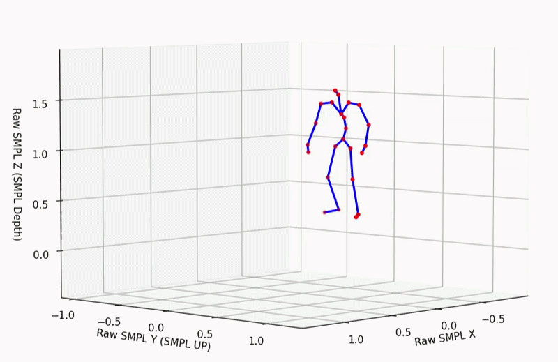
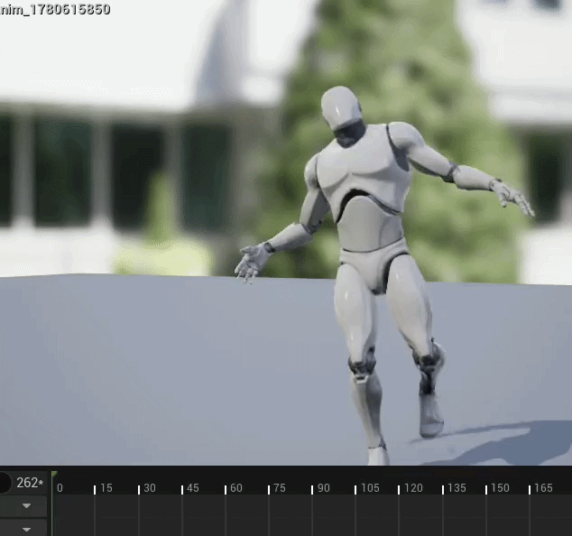
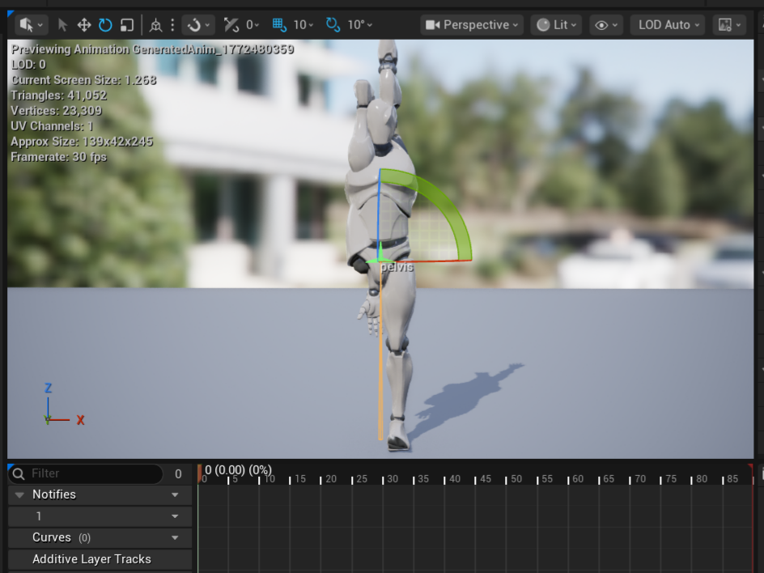
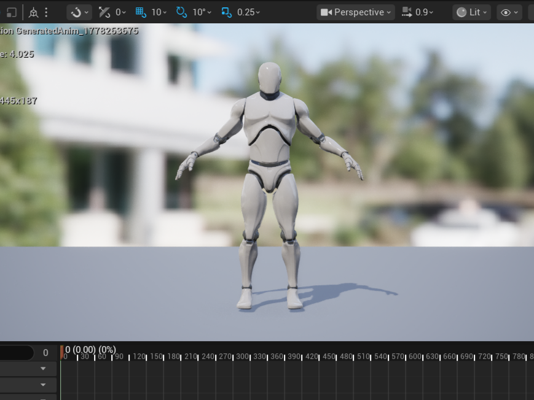

***

# AInimate: Animation Deployment Pipeline (ADP)
### Direct Mathematical Injection of AI-Generated Motion Data into Unreal Engine 5.6.1

**Project Status:** Phase 2 | Functional Proof-of-Concept  
**Role:** Stage 2 Core Developer (Skeletal Kinematics & C++ Engine Architecture)

---

## 🚀 The Objective: Bridging the "Deployment Gap"
While Generative AI can now synthesize human motion from text, a massive technical **"Deployment Gap"** remains: AI models output raw joint trajectories, but professional game engines require complex binary assets.

**AInimate** is an end-to-end framework designed to bridge this gap. While Stage 1 of the project (Generative Backend) focuses on synthesizing SMPL joint trajectories via Diffusion models, this repository contains **Stage 2: The Animation Deployment Pipeline (ADP)**. 

The ADP serves as a high-performance bridge that bypasses traditional, lossy FBX exports and manual retargeting. By performing **Direct Data Injection**—writing mathematical coordinate data directly into Unreal Engine's binary memory—the pipeline authors native `.uasset` animation sequences with zero data loss in $O(n)$ time.

---

## 📽️ Visual Validation (Input vs. Output)

| **Stage 1.5: SMPL Motion Data Visualized** | **Stage 2: Native Engine Injection** |
| :---: | :---: |
|  |  |
| *Raw SMPL parameter solving in Matplotlib, from **ACCAD Dataset*** | *Native .uasset injected and calibrated in UE5.6.1* |

---

## 📦 The Input: SMPL Motion Data
The pipeline begins with motion data represented via the **SMPL (Skinned Multi-Person Linear)** model. SMPL is the industry standard for academic human body representation but is natively incompatible with game engine skeletal structures.

*   **Learn more about SMPL:** [smpl.is.tue.mpg.de](https://smpl.is.tue.mpg.de)

### The `.npz` Data Contract
Our Stage 1 backend generates a compressed NumPy file (`input.npz`) containing:
*   **`global_orient`**: $[Frames, 3]$ — The world-space heading of the character.
*   **`body_pose`**: $[Frames, 69]$ — Local axis-angle rotations for 23 joints.
*   **`transl`**: $[Frames, 3]$ — Global $(X, Y, Z)$ translation vectors.
*   **`betas`**: $[10]$ — Shape coefficients defining the character's unique body proportions.

---

## 🛠️ Pipeline Stage 1: Python Pre-Processing (`smpl_converter.py`)
This module standardizes raw ML outputs into an "Engine-Ready" mathematical state.

*   **Coordinate Auto-Detection:** Utilizes a **Vertical Axis Dominance heuristic** to detect if source data is **Y-Up** (Standard SMPL) or **Z-Up** (AMASS/ACCAD) and applies the correct basis permutation.
*   **Root-Motion Splitting:** A specialized algorithm that "steals" horizontal displacement $(X, Y)$ from the pelvis and assigns it to a virtual **Root Bone**. The pelvis retains vertical $(Z)$ dynamics, enabling character navigation within Unreal’s physics system.
*   **Scalability via `bone_mapping.py`:** Rather than hardcoding bone names, the system uses a **Translation Dictionary**. This makes the project **skeleton-agnostic**; by simply updating this map, the pipeline can target any humanoid skeleton (MetaHumans, Mixamo, etc.) without changing a line of core logic.
*   **Ground Truth Validation (`visualize_npz.py`):** Before injection, we use this tool to solve the SMPL Forward Kinematics and render the motion in Matplotlib, ensuring the AI's output is physically sound.

---

## 🛠️ Pipeline Stage 2: C++ Injection Engine (`AInimateBPLibrary.cpp`)
Running natively within Unreal Engine 5.6.1, this backend performs the final bit-level asset authoring.

*   **Direct Memory Injection:** Utilizes the modern **`IAnimationDataController`** API to author animation curves directly in memory, ensuring zero data loss and $O(n)$ latency.
*   **Recursive FK Solver:** A hierarchical solver that translates corrected global transforms back into the parent-relative local keys required by the engine's `.uasset` format.
*   **Translation Locking Layer:** To prevent "Spaghetti Monster" artifacts (mesh tearing), I implemented a locking layer that forces deformer bones to the Unreal Reference Skeleton's lengths while preserving the high-fidelity AI-generated rotations.

---

## 🧠 Engineering Challenge: Resolving Skeletal Mismatch ($Q_{\Delta}$)

One of the primary hurdles in AI-to-Engine deployment is the **Rest Pose Discrepancy**. The AI model generates motion for a mathematical SMPL skeleton in a **T-Pose**, whereas the Unreal Engine 5 sk_mannequin is authored in an **A-Pose**.

### The Problem: Rotational Divergence
Directly mapping SMPL rotations onto a UE5 mesh results in severe limb distortion. Because the "zero state" of the arms differs by roughly 45 degrees, a "Walk" animation from the AI would cause the Unreal character’s arms to clip into its own chest or twist unnaturally.

### The Solution: Identity Calibration Algorithm
I developed a mathematical bridge that calculates a **Rotational Delta ($Q_{\Delta}$)** for every bone once at the start of the injection. By bringing both the SMPL Identity T-Pose and the Unreal Reference Pose into **Global Space**, the system "discovers" the structural difference between the two skeletons.

**The Calibration Formula:**
$$Q_{\Delta} = (Q_{SMPL\_Global\_Identity})^{-1} \otimes Q_{UE\_Global\_Reference}$$

This correction is applied to every frame, ensuring the character maintains perfect posture regardless of the target skeleton's native rest pose.

| **Direct Mapping (Twisted/Clipping)** | **Identity Calibration (Corrected)** |
| :---: | :---: |
|  |  |
| *Arms clipping due to T-Pose/A-Pose mismatch* | *Corrected alignment via QΔ math* |

---

## 📊 The Data Contract (JSON Bridge)
The stages communicate via a high-precision JSON bridge. This decoupled architecture allows the AI to be hosted on high-end GPU servers while the plugin remains lightweight for the developer's workstation.

```json
{
  "meta": {
    "calibration_pose": { "pelvis": {"location": [0,0,89], "rotation": [0,0,0,1]} },
    "frame_rate": 30
  },
  "frames": [
    { "bone_transforms": { "pelvis": {"location": [150, 200, 92], "rotation": [x,y,z,w]} } }
  ]
}
```

---

## ⚙️ Tech Stack
*   **Engine:** Unreal Engine 5.6.1 (C++, Blueprints)
*   **Deep Learning Support:** Python 3.10, PyTorch, SMPL-X (smplx)
*   **Math:** NumPy (v1.23.5 - pinned for binary stability), SciPy
*   **APIs:** IAnimationDataController, FReferenceSkeleton

---
*Developed as the Final Year B.Tech Project at Tezpur University.*